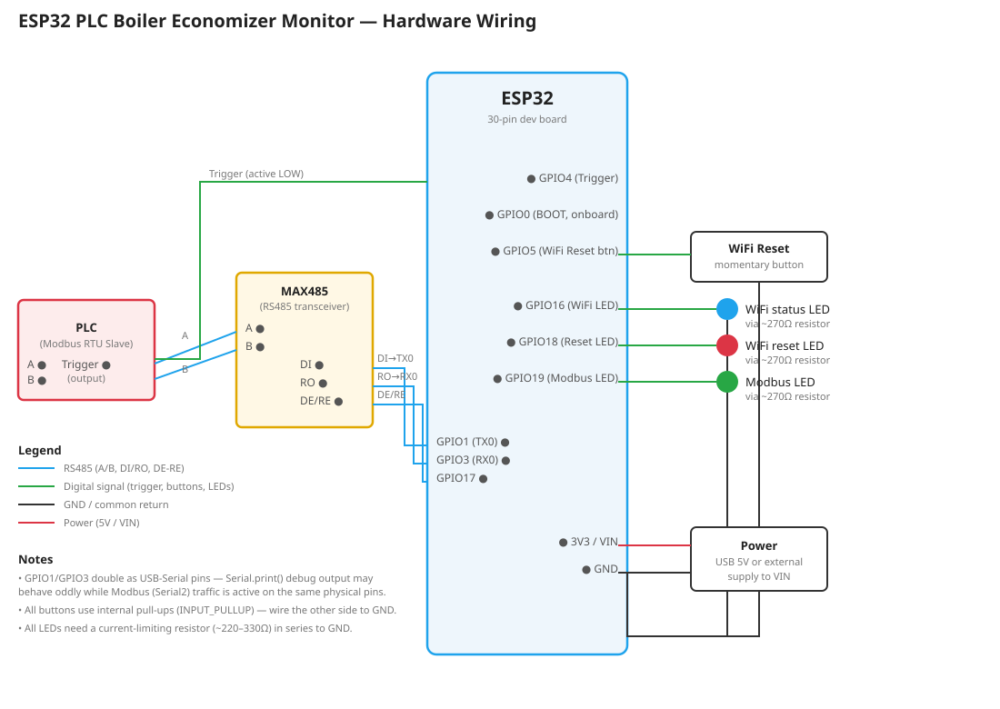

# ESP32 PLC Boiler Economizer Monitor

Reads boiler economizer data from a PLC over Modbus RTU (RS485) and sends a formatted report
to one or more Telegram chats whenever a trigger input goes LOW. Supports WiFi setup via a
captive portal, WiFi credential reset via a dedicated button, and firmware updates over the air
via GitHub.

## Features

- **Modbus RTU read (RS485)** — reads three PLC holding registers (D0, D2, D4 by default) in a
  single transaction and converts the raw integers to decimal values using a configurable scale
  factor.
- **Trigger-based reporting** — a digital input pin (internal pull-up, active LOW) fires a
  read-and-report cycle on each falling edge. A configurable cooldown prevents duplicate sends
  from signal bounce/noise.
- **Telegram alerts, multiple recipients** — sends a formatted Bengali-language report to a list
  of chat IDs, spaced out to respect Telegram's per-chat rate limit.
- **Proper UTF-8 message encoding** — a custom URL-encoder percent-encodes every byte of the
  message, so multi-byte UTF-8 text (Bengali script, emoji) transmits correctly.
- **WiFi setup via captive portal (WiFiManager)** — no hardcoded WiFi credentials. On first boot
  (or after a reset), the ESP32 broadcasts its own setup access point; connecting to it opens a
  page to enter your WiFi SSID/password, which is then saved to flash. The portal is custom
  branded ("Boiler Economizer Monitor" title, red buttons) via `setTitle()` and
  `setCustomHeadElement()`.
- **WiFi credential reset — two methods:**
  - **BOOT button**: hold during power-up to wipe saved credentials (only works at boot).
  - **Dedicated reset button (GPIO5)**: hold for 3 seconds *at any time* during normal operation
    to wipe credentials and reboot into the setup portal — no power cycle needed.
- **OTA firmware updates via GitHub** — checks a `version.txt` file in a GitHub repo at boot and
  every 6 hours. If the remote version differs from the running firmware, it downloads and
  flashes `firmware.bin` automatically, then reboots.
- **Three status LEDs:**
  - **WiFi LED (GPIO16)** — solid ON when connected, OFF otherwise, updated continuously.
  - **WiFi Reset LED (GPIO18)** — turns ON as soon as the reset button is held, fast-blinks to
    confirm the reset fired.
  - **Modbus LED (GPIO19)** — flashes on a successful register read, double-blinks on a failed
    read.

## Hardware

- ESP32 30-pin dev board (e.g. eletechsup ES30485 module)
- Onboard MAX485 RS485 transceiver (fixed to GPIO1 / GPIO3 / GPIO17 on this board)
- PLC with Modbus RTU over RS485
- 1x momentary push button (WiFi reset)
- 3x LEDs + current-limiting resistors (~220–330Ω)

## Pin Map

| Function | Pin | Notes |
|---|---|---|
| RS485 DE/RE | GPIO17 | Direction control for MAX485 |
| RS485 RX (Serial2) | GPIO3 | Shared with USB-Serial (Serial) — see note below |
| RS485 TX (Serial2) | GPIO1 | Shared with USB-Serial (Serial) — see note below |
| Trigger input | GPIO4 | `INPUT_PULLUP`, active LOW, wire to PLC output |
| BOOT button | GPIO0 | Onboard; hold at power-up to reset WiFi |
| WiFi reset button | GPIO5 | `INPUT_PULLUP`, wire to GND, hold 3s at any time |
| WiFi status LED | GPIO16 | Through resistor to GND |
| WiFi reset LED | GPIO18 | Through resistor to GND |
| Modbus status LED | GPIO19 | Through resistor to GND |

> **Note:** GPIO1/GPIO3 are also the ESP32's default USB-Serial pins. `Serial.print()` debug
> output over USB may behave oddly while Modbus traffic is active on Serial2, since they share
> the same physical pins on this board.

## Libraries Required

Install via Arduino IDE **Tools → Manage Libraries**:

| Library | Author | Purpose |
|---|---|---|
| `ModbusMaster` | Doc Walker | Modbus RTU master communication with the PLC |
| `WiFiManager` | tzapu | Captive portal for WiFi setup without hardcoded credentials |

Built into the ESP32 board package (no install needed):
- `WiFi.h`
- `WiFiClientSecure.h`
- `HTTPClient.h`
- `Update.h`

## Configuration

All user-editable settings are in the `USER CONFIG` block near the top of the `.ino` file:

- `WM_AP_NAME` / `WM_AP_PASSWORD` — name/password of the WiFi setup portal
- `TELEGRAM_BOT_TOKEN` — from [@BotFather](https://t.me/BotFather)
- `TELEGRAM_CHAT_IDS[]` — one entry per recipient (each must have messaged the bot at least once)
- `REG_START` / `REG_COUNT` / `REG_*_IDX` — Modbus register addresses and offsets
- `SCALE_FACTOR` — divisor to convert raw register integers to decimal values
- `COOLDOWN_MS` — minimum time between trigger-fired reports
- `FIRMWARE_VERSION` — bump on every release
- `OTA_VERSION_URL` / `OTA_FIRMWARE_URL` — raw GitHub URLs to `version.txt` and `firmware.bin`
- `OTA_CHECK_INTERVAL_MS` — how often to check for updates while running

## First-Time Setup

1. Install the required libraries (see above).
2. Fill in the `TELEGRAM_BOT_TOKEN` and `TELEGRAM_CHAT_IDS` in the code.
3. Update `OTA_VERSION_URL` / `OTA_FIRMWARE_URL` to point at your GitHub repo.
4. Flash the sketch via USB.
5. On first boot, connect to the `ESP32-PLC-Setup` WiFi network from your phone and enter your
   real WiFi credentials in the portal that appears.
6. Wire the RS485 lines to the PLC, the trigger input to the PLC's alarm/report output, and the
   three LEDs + reset button per the pin map above.

## Releasing a Firmware Update (OTA)

1. Edit the code and bump `FIRMWARE_VERSION` (e.g. `"1.0.2"` → `"1.0.3"`).
2. **Arduino IDE → Sketch → Export Compiled Binary.**
3. Rename the exported `<sketch_name>.ino.bin` to `firmware.bin`.
4. Upload `firmware.bin` to the GitHub repo **first**, and commit.
5. Update `version.txt` in the repo to match the new version, and commit **after** step 4.
6. Devices pick up the update automatically at their next boot or periodic check
   (`OTA_CHECK_INTERVAL_MS`).

> Uploading `firmware.bin` before `version.txt` avoids a window where a device could see the new
> version number but download the old binary.

## USB Upload vs. GitHub OTA — When to Use Which

- **USB upload** is enough for local development, testing, or a single dev board on your desk.
  Any code change — including things like portal branding/styling, register mapping, LED
  behavior, etc. — takes effect immediately once flashed over USB. No GitHub changes required.
- **GitHub OTA (bump `FIRMWARE_VERSION` → export binary → push `firmware.bin` then
  `version.txt`)** is only needed when you want devices already deployed in the field — ones
  you're not physically holding — to receive the update automatically over WiFi.

If you're just iterating on your desk, skip the GitHub round-trip and upload over USB — it's
faster. Reserve the OTA release flow for changes you actually want to ship to devices already
installed on-site.

## Resetting WiFi Credentials

- **At power-up:** hold the **BOOT** button while plugging in / resetting the board.
- **While running:** hold the dedicated **WiFi reset button (GPIO5)** for 3 seconds. The WiFi
  Reset LED lights up as soon as you start holding, and fast-blinks to confirm the reset fired.

Either method wipes saved credentials and reopens the `ESP32-PLC-Setup` portal.
